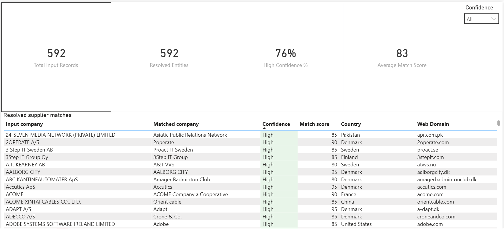

# POC Simulation

------------------------------------------------------------------------

##  Dashboard Preview

------------------------------------------------------------------------

##  Project Overview

Instead of relying on a single similarity score, the solution applies a
100% weighted model across multiple validation layers to determine
overall match confidence. The dashboard provides both a high-level
overview and detailed drill-down analysis for business review.

------------------------------------------------------------------------

##  Project Objectives

-   Pick the best match per input company (no double counting)
-   Build a scoring system that makes sense
-   Separate strong matches from questionable ones
-   Keep the dashboard simple  for business users

------------------------------------------------------------------------

##  Thought Process & Methodology

###  One Best Match per Input

The raw dataset included multiple potential matches per company.

To avoid inflating KPIs or counting the same company multiple times,
I: - Grouped by input - Evaluated total score - Kept only the
highest-scoring match

one input = one final decision.

------------------------------------------------------------------------

###  The Scoring Framework (Clear & Scalable)

Instead of relying on one raw score, I created a 100% weighted model
split into three tiers.

------------------------------------------------------------------------

##  Tier 1 --- Identity & Trust (50%)

If identity is wrong, nothing else matters.
  
| Criterion | Weight | What it checks |
|-----------|--------|----------------|
| Website domain | 20% | Real domain (not placeholder, not facebook/linktree) |
| Company name match | 15% | Strong similarity to input name |
| Country match | 10% | Matches input country |
| Year founded | 5% | Reasonable year (not 0, not future) |

Max contribution: 50%

------------------------------------------------------------------------

##  Tier 2 --- Business Depth (30%)

Signals that the company looks real and properly profiled.

| Criterion | Weight | What it checks |
|-----------|--------|----------------|
| LinkedIn URL | 10% | Valid linkedin.com/company/ format |
| Employee count | 10% | Numeric and > 0 |
| Revenue | 5% | Numeric and > 0 |
| Industry / sector | 5% | Not “Other”, not null |

Max contribution: 30%

------------------------------------------------------------------------

##  Tier 3 --- Contact Quality & Freshness (20%)

Helpful signals, but they shouldn't overpower identity.

| Criterion | Weight | What it checks |
|-----------|--------|----------------|
| Business email | 5% | Contains @, not gmail/yahoo |
| Phone number | 5% | Numeric length above threshold |
| Address fields | 5% | City + country present |
| Last updated | 5% | Recent relative to dataset |

Max contribution: 20%

------------------------------------------------------------------------

### 3️ Confidence Classification

After calculating the total weighted score (0--100%), matches are
grouped into:

-   High Confidence → Strong identity + solid supporting signals
-   Medium Confidence → Looks acceptable but worth reviewing
-   Low Confidence → Weak validation, likely needs manual check

The structure ensures identity drives the decision, not just contact
details.

------------------------------------------------------------------------

##  What the Dashboard Shows

### Executive View

-   Distribution of High / Medium / Low confidence matches
-   Quick understanding of overall matching reliability

### Detailed View

-   Record-level inspection
-   Score breakdown
-   Easy identification of edge cases

------------------------------------------------------------------------

##  Business Impact

This solution enables:

-   Structured data quality monitoring
-   Faster identification of unreliable matches
-   Clear prioritization for manual review
-   Increased trust in automated matching systems

------------------------------------------------------------------------

##  Repository Structure

/clean_data\
BestMatch_PerInput_Final.xlsx

/raw_data\
presalse_data_sample.csv

/powerbi\
Company_Matching_Quality_v2_ClientReady.pbix

/screenshots\
(Dashboard screenshots)

------------------------------------------------------------------------
